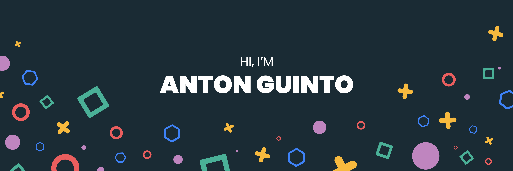

## KIA ORA, HELLO, KAMUSTA 👋
I develop mobile apps using Flutter and websites using NextJS. I have shipped several digital products for my clients and previous companies I have worked with. Im also deep diving into Web3 development and enjoying the journey so far.

## About Me
- 💙 I build my mobile apps with Flutter
- :fire: I build web apps with React 
- ⚡ I'm currently working on a blockchain based project
- 🌱 I’m currently learning Solidity
- 👨‍💻 Deep diving into Nextjs, Solidity & Tailwind
- 👾 [Playstore Developer Page](https://play.google.com/store/apps/dev?id=6591320921243949726)
- 🍎 Apple Developer Page (Soon)

## Technologies
### My web tech stack

### My mobile tech stack & tools

##
📫 Reach me @: **antonvinceguinto@gmail.com**
